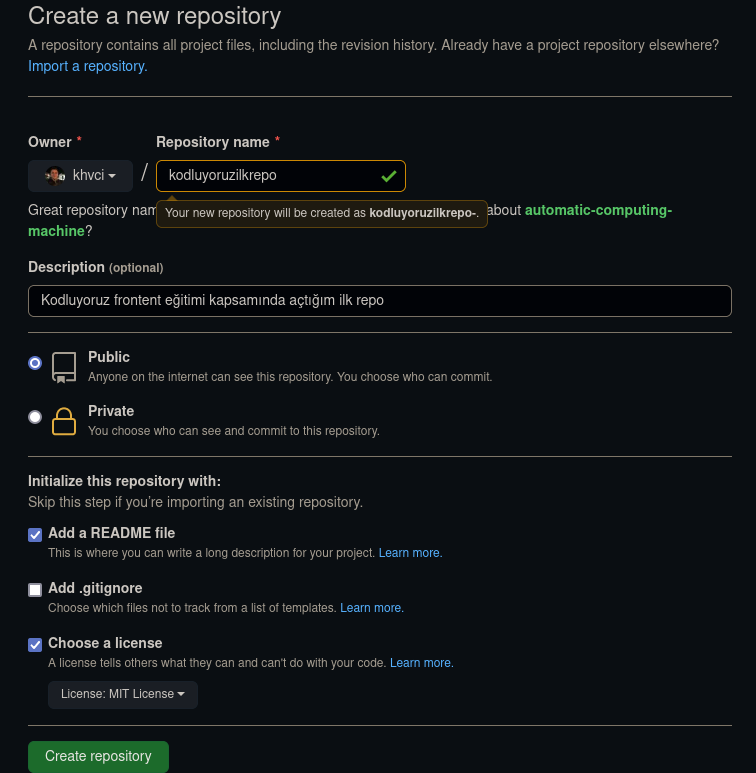

# kodluyoruzilkrepo
Kodluyoruz Front-End Eğitimi kapsamında açtığım ilk repo. İçerisinde bir adet README dosyası, bir adet ekran görüntüsü, ve bir adet de index.html barındırıyor.



# Installation

Öncelikle projeyi clonelayın.
```
git clone https://github.com/khvci/kodluyoruzilkrepo
```
# Usage

Projeyi cloneladıktan sonra VS Code programında açın.

Linux için:
```
cd kodluyoruzilkrepo
code .
```
# Contributing

Pull requestler kabul edilir. Büyük değişiklikler için, lütfen önce neyi değiştirmek istediğinizi tartışmak için bir konu açınız.

# Licence

[MIT](https://choosealicense.com/licenses/mit/)
